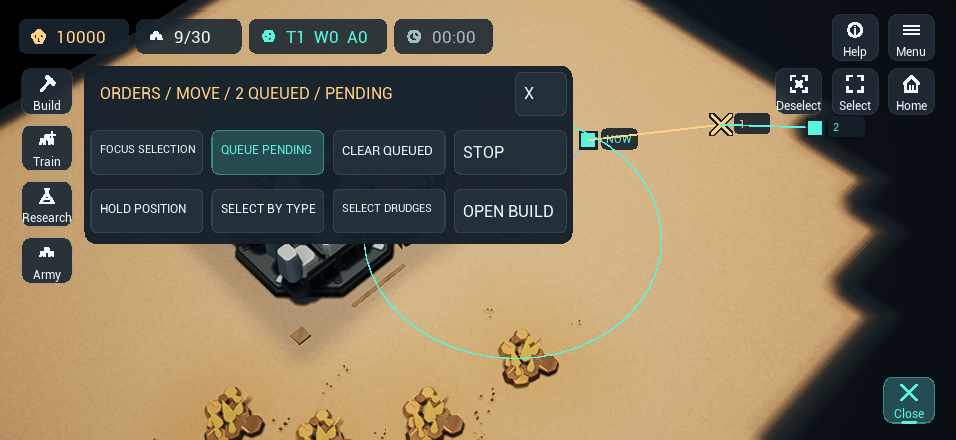

# Tactical order sequences

Updated 2026-09-14. Status: implemented and locally verified; physical acceptance remains open. Implements the bounded P1.1 slice in the [gameplay roadmap](SC2_GAMEPLAY_ROADMAP.md) and [order contract](TACTICAL_ORDERS_PLAN.md). P1 remains open until its input and gameplay acceptance gates pass.

## Behavior

- Ordinary orders replace a unit's current work and future route. Desktop Shift appends Move or Attack-move destinations. Touch uses the one-shot Queue next control in the Orders sheet after choosing Move or Attack-move.
- A unit can retain 16 future destinations. Each accepted group command stores each unit's formation point; later arrivals do not recalculate those points. An idle recipient starts immediately. Stop clears all orders; Clear queued orders preserves the current one.
- The HUD shows the primary owned unit's current destination and numbered future points, current/waiting/blocked feedback, and additional unit routes. Build, Train, Research and Army access remains available.
- A blocked route retains its waypoint and tail. Opening the route lets it continue in order. An incidental Attack-move engagement does not finish the waypoint.
- Steps appended behind an already-current Hold or Defend may wait indefinitely. Issuing a new Hold or Defend replaces the current command and clears the route; there is no separate resume-queued control in P1.1.
- Explicit queued work takes priority after construction finishes or is interrupted. A Gather successor waits for depletion and final cargo delivery; a temporarily missing depot preserves delivery. Automatic Build avoids workers with explicit future plans.
- Mender Attack-move retains its own destination and an optional friendly support relation. Support steering must make progress toward the waypoint; it cannot strand the Mender short of a wide formation slot. Losing a leader clears support without discarding the route. Explicit direct Attack/follow remains separate.
- Online Queue next waits for the matching server acknowledgement. Acceptance consumes it; rejection retains the same targeting intent. Selection changes, cancel, pause/background and match transitions invalidate the intent. A late reply cannot restore it, and an uncertain reconnect outcome clears targeting to avoid duplicate orders.

Canceling pending targeting affects only the local one-shot control; it does not recall a command already sent to the server. That command may still be accepted. Check the refreshed authoritative route before retrying. The in-game field guide covers appending, queue limits, Clear queued, replacement and waiting behind Hold/Defend.

## Persistence and transport

Source now uses save version **11** and network protocol **8**. Saved commands carry queue mode; the final `ORDER_QUEUES 1` section stores every entity's support and future route. Versions 1–10 migrate with empty future lists and Replace mode. Invalid records reject atomically.

Only owned routes and support references appear in a player snapshot, using the existing opaque identity mapping. Hostile snapshots with private enemy plans are rejected. Append validation checks all recipients before mutation, including 16 future orders per unit, 4,096 per player and the existing 1 MiB encoded frame ceiling. The authoritative worker also checks all active player views before accepting a command.

Previously packaged protocol-7 clients were not updated by this pass. Client, server and worker must be released together; this document does not record a deployment or device installation.

## Verification

| Gate | Current result |
| --- | --- |
| Portable Release | 19/19 suites pass; [log](../artifacts/tactical-orders/release.log) |
| Address/undefined-behavior sanitizers | 19/19 suites pass using `RelWithDebInfo`, matching the preceding P0 sanitizer configuration; [log](../artifacts/tactical-orders/sanitize.log) |
| Local Node/C++ worker | 34/34 tests pass with the freshly built protocol-8 worker; [log](../artifacts/tactical-orders/server.log) |
| Mac Unreal build | Pass; [log](../artifacts/tactical-orders/unreal-build.log) |
| Unreal integration and tutorial suites | 38/38 pass; 37 clean and one with the two explicitly allowed host `idevice_id` warnings; [report](../Saved/Automation/Integration/20260914T170835Z-32740/index.json) |
| Real Unreal two/four-player loopback transport | 2/2 pass without warnings; [report](../Saved/Automation/Multiplayer/20260914T171017Z-33078/index.json) |
| Desktop and compact HUD captures | Four scripted Mac captures inspected: short readable queue controls, armed/pending state and both numbered future points. The initial small labels and clipped fixture waypoint were corrected; [capture record](../artifacts/tactical-orders/preview-verification.json) |
| Synthetic queue/navigation workloads and paid repeats | Queue workloads 16/160/200 and all navigation arrivals 160/200/400 pass. Complete paid two/four-player workloads pass all 160/320 army arrivals and deterministic repeats |
| Physical mouse/touch playtest, current iPhone package and sustained thermal acceptance | Pending |

The current 12-case tactical suite also passes an explicit version-10 migration check in both [Release](../artifacts/tactical-orders/release-save10.log) and [sanitizers](../artifacts/tactical-orders/sanitize-save10.log), preserving current orders, economy, production jobs, rallies and recorded command defaults.

The [combined verification record](../artifacts/tactical-orders/verification.json) records report paths, source and tested binary hashes, queue/navigation workloads, paid repeats and capture receipts. The [source manifest](../artifacts/tactical-orders/source-sha256.json) describes the dirty checkout, including contextual files; it does not claim that concurrent platform packaging changes were validated. All heavyweight checks ran serially with compilation capped at two jobs. Captures used a 30 FPS ceiling and preserved the player's save and tutorial/skirmish preferences. Test runtimes were closed after capture.

The new portable suites include independent mixed-speed arrivals, Attack-move combat, a 16-unit Mender formation, clear/stop/replace semantics, atomic queue limits, worker interruption, depleted Gather delivery, corrupt save rejection and replay continuation. Codec checks cover incompatible versions, malformed modes, private enemy routes, invalid support references and frame-size rejection without state or recording changes.

Review caught and corrected the wide-formation support loop, a stale LAN protocol compile gate, malformed ClearOrders codec fields and misleading idle-selection route feedback. The first Unreal build also exposed a checked-format string incompatibility, corrected before the successful build.

An initial unoptimized Debug sanitizer run exceeded the AI suite's 120-second timeout and was stopped. Its [log](../artifacts/tactical-orders/sanitize-debug-timeout.log) is retained. The final run uses the same optimized sanitizer configuration as P0; sanitizer instrumentation remains enabled and test workloads/timeouts were not relaxed.

## Queue cost and movement workload evidence

The [queue benchmark](../artifacts/tactical-orders/queue-baseline.json) is a synthetic open-map Mac CPU fixture with mixed units including Menders. It issues 16 group appends while units hold position; it does not advance simulation ticks or measure rendering, transport latency or phone performance. Each size preserves its accepted points and current Hold, rejects the 17th append without changing state/recording, and reproduces the same state and recording on repeat. The 16 timing samples per size are a short diagnostic, not a sustained-performance claim.

| Units | Full future steps | Append p50 / max (ms) | Full snapshot bytes |
| --- | --- | --- | --- |
| 16 | 256 | 0.046 / 0.064 | 5,192 |
| 160 | 2,560 | 1.503 / 1.595 | 48,845 |
| 200 | 3,200 | 1.385 / 1.451 | 60,977 |

The [navigation workloads](../artifacts/tactical-orders/navigation-baseline.json) reach all 160, 200 and 400 destinations with no unexplained order loss and matching repeats. The [paid two-player workload](../artifacts/tactical-orders/paid-two-player.json) prepares 100 mobile units/184 crew per player through ordinary economy and production, reaches all 160 original army destinations, and completes its fixed combat phase with matching state, trajectory and recording hashes. Preparation step p50/p95/p99/max is 0.443/0.993/1.249/75.372 ms. This scripted workload ends at its predeclared tick boundary, not a player victory, and is distinct from a physical full match.

The [paid four-player workload](../artifacts/tactical-orders/paid-four-player.json) also completes preparation, all 320 original army destinations and the fixed combat phase with identical state, trajectory and recording repeats. Preparation step p50/p95/p99/max is 1.367/2.958/3.865/145.116 ms; march is 0.966/1.308/1.801/8.130 ms and combat is 0.243/1.522/2.840/5.466 ms. The preparation spike remains a P0 performance issue; this pass does not claim to have reduced it.

New hash fields, recording mode and Mender waypoint behavior establish a new P1 baseline. These results require matching repeats on current code; they do not assert cross-version hash equality with P0. The [frozen core inputs](../artifacts/tactical-orders/frozen-core-sha256.json) retain the tested simulation and benchmark executables for later comparisons.

## Still pending

- Play the exact resulting package with real mouse and iPhone touch input, including rejection and reconnect behavior.
- Continue P1.2 patrol/escort and P1.3 formation facing/spacing. These are separate features; waypoint queues do not complete them.
- Keep P0 performance/device work and the broader P2–P7 roadmap open. No SC2 parity, phone performance, Android packaging or public multiplayer release claim is made here.
